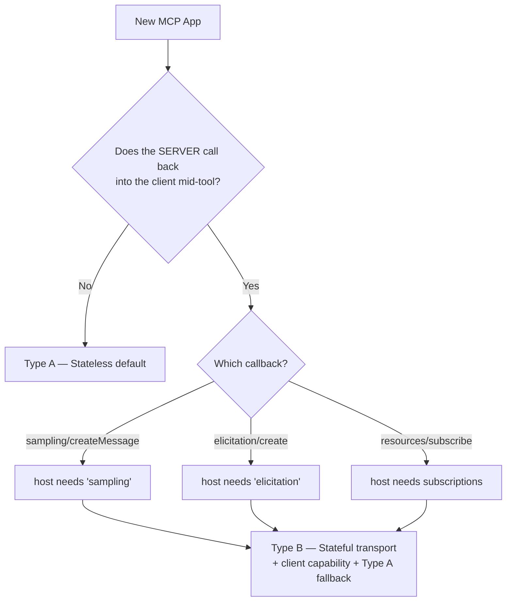

# Server-Initiated Requests — Sampling, Elicitation, Subscriptions (Frame Type B)

Most MCP Apps are **Display Frames (Type A)**: a tool is called, it returns
content + a `ui://` resource, the host renders it, done. These run on the default
**stateless** transport and need no special handling.

Some apps need the **server to call back into the client mid-tool** — borrow the
host's model (sampling), ask the user a structured question (elicitation), stream
progress, or push live resource updates. These are **Interactive / Agentic Frames
(Type B)**, and they have two hard requirements the scaffold does not give you by
default.

> Rule of thumb: **any server→client *request* (not just a notification) makes
> your app Type B.** Sampling and elicitation are requests; they need a response
> routed back to the *same* transport.

---

## The two requirements

### 1. A stateful transport (server side)

`sampling/createMessage` and `elicitation/create` are **server→client requests**.
The client's reply arrives as a **separate HTTP POST**. With the default
stateless transport (`sessionIdGenerator: undefined`) the SDK builds a *fresh*
transport per request, so the reply lands on an instance that never issued the
request — the original `await` never resolves and the tool **times out**
(`MCP error -32001: Request timed out`).

Fix: use the **stateful** `main.ts` template in [scaffold.md](scaffold.md)
(`sessionIdGenerator: () => randomUUID()` + a transport map keyed by
`Mcp-Session-Id` + GET SSE). This gives the reverse channel a stable home.

> **stdio** transport is inherently bidirectional, so sampling works there with
> no session bookkeeping — which is why headless tests spawn the server with
> `--stdio`. The stateful HTTP transport is what makes it work for *browser/host*
> clients over HTTP.

### 2. A client that advertises the capability (host/client side)

The host's MCP **client** must declare the capability at initialization and
answer the request. You only control this if you also own the client (e.g. a
custom host). For third-party hosts (VS Code, Claude, etc.) it is a host feature
you must detect, not assume.

```typescript
// Custom host / client side — declare capability + handle the request.
import { CreateMessageRequestSchema } from "@modelcontextprotocol/sdk/types.js";

const client = new Client(
  { name: "MyHost", version: "1.0.0" },
  { capabilities: { sampling: {} } },        // ← REQUIRED, else the server's call rejects
);
client.setRequestHandler(CreateMessageRequestSchema, async (req) => {
  const text = await runMyModel(req.params);  // your model / SDK
  return { role: "assistant", content: { type: "text", text }, model: "my-model" };
});
```

This handler is **inert** for Display-Frame apps — it only fires when a server
actually issues `sampling/createMessage`. A host can declare it universally.

> **Authoring the host?** [`../mcp-app-hosts/copilot-sdk-host.md`](../mcp-app-hosts/copilot-sdk-host.md)
> has a full reference implementation of this handler backed by the GitHub Copilot SDK
> (`sampleViaCopilot`), including **agentic sampling** (server-offered tools the model may call
> mid-sample).

---

## Server-side usage

```typescript
// Inside a tool handler. `server` is McpServer; `.server` is the low-level Server.
try {
  const reply = await server.server.createMessage({
    messages: [{ role: "user", content: { type: "text", text: userText } }],
    systemPrompt: "You give one-sentence hints. Never reveal the answer.",
    maxTokens: 80,
    temperature: 0.7,
  });
  // NOTE: reply.content is a SINGLE content block, not an array (unless tools were sent).
  if (reply.content.type === "text") useHint(reply.content.text);
} catch {
  degradeGracefully();   // host has no sampling, user declined, or transport can't deliver
}
```

Elicitation is the same shape with `server.server.elicitInput({ message,
requestedSchema })` and returns `{ action: "accept"|"decline"|"cancel", content? }`.

---

## Graceful degradation is mandatory

A Type B feature **will** be unavailable in some hosts. Check the negotiated
client capability and branch — never let the tool hang:

```typescript
const caps = server.server.getClientCapabilities();
if (caps?.sampling) {
  // safe to call createMessage
} else {
  return { content: [{ type: "text", text: "AI hint unavailable in this host." }] };
}
```

**Ship every Type B app with a Type A fallback path.** That single discipline
makes the same binary portable: it does the smart thing where the host supports
it, and degrades to plain display everywhere else.

---

## Cross-host validation (run before relying on Type B in a new host)

1. **Connect probe** — initialize and dump `getClientCapabilities()`. Confirm
   `sampling` / `elicitation` is present. If absent, the host can't drive Type B.
2. **Transport probe** — confirm a session id round-trips: `initialize` →
   capture `Mcp-Session-Id` → follow-up POST with that header + a GET for SSE. A
   400 means the host isn't doing stateful sessions.
3. **Round-trip probe** — call the sampling tool end-to-end; assert it returns
   instead of erroring `-32001`. The single most decisive test.
4. **Degradation probe** — point the app at a host *without* `sampling` and
   assert it returns the fallback, not a hang.

See [`../mcp-app-hosts/host-matrix.json`](../mcp-app-hosts/host-matrix.json)
(`server-initiated` block per host) for which hosts have been validated, and
[`../mcp-app-test/cross-host.md`](../mcp-app-test/cross-host.md) for the matrix.

---

## Decision flow



**Checklist to stay Type A (preferred):** no `createMessage`, no `elicitInput`,
no `resources/subscribe`, and any progress completes within a single best-effort
tool call. Any one fails → Type B.
